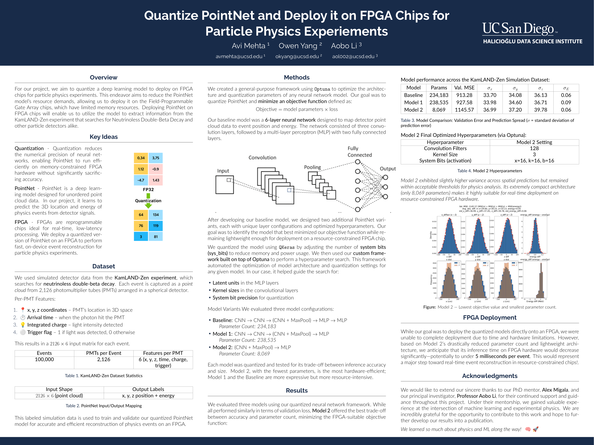

# Quantize PointNet and Deploy it on FPGA Chips for Particle Physics Experiments

Research conducted at the Halıcıoğlu Data Science Institute (HDSI), UC San Diego
under the supervision of Professor Aobo Li and PhD mentor Alex Migala, in
collaboration with Owen Yang.

## Overview
Particle physics experiments like KamLAND-Zen generate massive amounts of
real-time detector data that need to be processed quickly and efficiently. This
research quantizes PointNet — a deep learning model for point cloud data — and
deploys it on FPGA chips to perform fast, on-device event reconstruction for
neutrinoless double-beta decay detection.

Each event is captured as a 2,126 × 6 point cloud from photomultiplier tubes (PMTs)
arranged in a spherical detector. Our goal was to minimize model size while
maintaining accuracy, enabling real-time inference on memory-constrained hardware.

## Results
| Model    | Params  | Val. MSE | σx    | σy    | σz    |
|----------|---------|----------|-------|-------|-------|
| Baseline | 234,183 | 913.28   | 33.70 | 34.08 | 36.13 |
| Model 1  | 238,535 | 927.58   | 33.98 | 34.60 | 36.71 |
| Model 2  | 8,069   | 1145.57  | 36.99 | 37.20 | 39.78 |

Model 2 achieved a ~97% reduction in parameter count while remaining within
acceptable accuracy thresholds for physics analysis.

## Impact
Deploying quantized neural networks on FPGAs enables real-time, low-latency
event reconstruction directly on detector hardware — eliminating the need for
expensive GPU clusters. Model 2's compact architecture anticipates inference
times under 5ms per event, making it a viable path toward live deployment in
particle physics experiments like KamLAND-Zen.

## Tech Stack
- **Model:** PointNet (point cloud deep learning)
- **Quantization:** QKeras (sys_bits tuning for activation, kernel, and bias)
- **Hyperparameter Optimization:** Optuna
- **Dataset:** KamLAND-Zen simulated detector data (100,000 events, 2,126 PMTs)
- **Hardware Target:** FPGA chips
- **Frameworks:** PyTorch, TensorFlow/Keras

## Poster

<a href="HDSI%20Undergraduate%20Scholarship%20Project.pdf" download>Download PDF</a>
